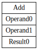

# **GDC - GDC Doesn't Compile**

This is *tensor compiler* that parses **ONNX** format into
**IR** and runs optimization passes (currently there are 0).
This is an educational project for Tensor Compilers course in MIPT. Made
for sole purpose of getting gud (or at least better).

## Compiling steps

### Read graph

Firstly we read a graph of a model from `.onnx` files, which are placed in folder [models](models). We use [ONNX library](https://github.com/onnx/onnx) for that. After that we translate it into our graph structure, which is ready for **GraphViz** dump.

### Visual dump

As an example of **GraphViz** dump we have this picture, which shows the structure of the model from [this file](models/Add.onnx)



## CodeGen

We add **codegen** to make a simple way for adding more instructions and implement wrappers for them for getting a more suitable operation of getting a concrete attribute or parameter by it's name but not by index.

Open folder [include/codegen](include/codegen) for more details.

## Tests

We add tests for checking read nodes from `.onnx` files. We read instructions and check their names and number of input and output parameters.

We also have **CI** to test that our project could be built and correctly works by using our tests.

Open folder [tests](tests) for more details.

## Build

### Build dependencies

<table>
    <thead>
        <tr>
            <th align="center">Target</th>
            <th align="center">Libraries</th>
        </tr>
    </thead>
    <tbody>
        <tr>
            <td align="center">
            Compiler
            </td>
            <td align="center">
            CLI11, ProtoBuf
            </td>
        </tr>
        <tr>
            <td align="center">
            Tests
            </td>
            <td align="center">
            Catch2, ProtoBuf
            </td>
        </tr>
    </tbody>
</table>

To get these deps you need to run current script

``` bash
    sudo apt-get update

    sudo apt-get install -y build-essential cmake catch2 protobuf-compiler libprotobuf-dev libcli11-dev
```

### Build script

To build run this script

``` bash
sh codegen.sh

cmake -S . -B build
# You can also choose the target
# by  flag -DCMAKE_BUILD_TARGET=SomeThing
# You need to write "GiantDad" after '=' to build the compiler
# If you need to check tests, you should write "GiantDadTests"

cmake --build build
```

## Run

To run the compiler you can use this syntax

``` bash
./GiantDad -f model.onnx
./GiantDad --file model.onnx
```

To run the tests for the compiler you should just run `./GiantDadTests`
